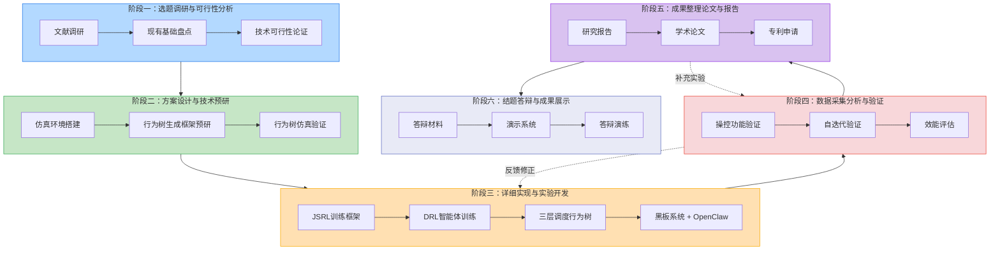

# 大学生创新创业训练计划 — 项目实施计划书

**项目名称：** 面向忠诚僚机超视距空战的知识数据双驱动无人智能及自迭代技术研究
**项目负责人：** 李欣洋
**指导教师：** 曾俊杰
**起止时间：** 2026年6月1日 — 2027年6月1日
**所属单位：** 国防科技大学 军政基础教育学院

---

## 使用说明

### 1. 本文档用途

本文档是本项目从启动到结题的全周期执行计划书。它将申请书中的技术路线重构为管理上可操作、时序上可检查的六个标准阶段，每个阶段给出目标、步骤、依赖、资源、交付物五项核心要素，团队成员无需反复解读即可直接按照本文档推进工作。

### 2. 阶段划分逻辑

六个阶段按时间串行推进，但技术内容高度耦合。下图展示阶段间的前后依赖与反馈关系：



**各阶段时间跨度：**

| 阶段 | 名称 | 时间 | 周期 |
|:----:|------|------|:----:|
| 一 | 选题调研与可行性分析 | 2026.06.01 — 2026.06.30 | 4周 |
| 二 | 方案设计与技术预研 | 2026.07.01 — 2026.10.31 | 18周 |
| 三 | 详细实现与实验/开发 | 2026.11.01 — 2027.03.31 | 22周 |
| 四 | 数据采集、分析与验证 | 2027.04.01 — 2027.05.15 | 6周 |
| 五 | 成果整理、论文与报告撰写 | 2027.05.01 — 2027.05.31 | 4周 |
| 六 | 结题答辩与成果展示准备 | 2027.05.15 — 2027.06.01 | 2周 |

> **注意：** 阶段五与阶段四/六存在时间重叠，体现成果整理与实验收尾的并行性；阶段二周期较长，因其同时覆盖仿真环境搭建和行为树设计两大技术预研任务。

### 3. 使用方式

- **项目负责人**：以每阶段的"里程碑"作为检查点，在周例会上逐项核对完成情况。
- **各成员**：找到自己主责的阶段和步骤，以"关键任务清单"为每日工作指引。
- **指导教师**：以"预期交付物"为进度审查依据，判断阶段成果是否达标。
- **修改维护**：本项目技术路线如果调整，只需在对应阶段内增删步骤，其余阶段的依赖关系表中已标注清楚，方便联动修改。

### 4. 进度追踪（2026-09-01 起）

项目全局进度与完成状况以根目录《项目状态与进度总览.md》为唯一权威来源，周例会对照其"步骤状态总表"逐项核对。本计划书各步骤清单中的勾选框不再逐一维护（历史遗留未勾选不代表未完成）。

| 计划步骤 | 状态 | 说明 |
|---------|:--:|------|
| 步骤2.1 机型选型与约束 | ✅ | 2026-08 中旬完成：F-104 主选 + F-4N 备选，约束在环境边界判定中生效，JSBSim 定制改动 10 项 |
| 步骤2.2 导弹/雷达模型 | ✅ | 2026-08-17：24 项单测全过，攻击区图 4 张（`多任务智能体/validation/results/D2.2-3_*.png`） |
| 步骤2.3 Gym 接口 | ✅ | 2026-08-17：check_env 通过、4 实例并行 1611 steps/s ≥1000 达标、20 项单测全过 |
| 步骤2.4 可视化 | ⬜ | 逾期未开始，仍需完成（方案A 2D 战术显示 + 回放） |
| 步骤2.5 LLM 行为树框架 | ⬜ | 未开始（当前窗口内，里程碑 M2.5 截止 9.15；bt_validator Python 重写已备） |
| 步骤2.6 / 2.7 | ⬜ | 未开始（9.16 起 / 10 月中下旬） |
| 阶段三技能层前哨 | 🟡 | 5 技能任务智能体（巡航/盘旋/爬降/追击/规避）验证性运行通过，任务级智能体仍按阶段三执行 |

---

## 阶段一：选题调研与可行性分析

### 1.0 阶段总体目标与里程碑

**总体目标：** 完成超视距空战无人僚机智能决策领域的技术调研，确认技术路线的可行性与创新性，形成文献综述报告与技术可行性分析报告，为后续方案设计提供依据。

**里程碑：**
- M1.1（第2周末）：完成文献检索框架搭建，检索到≥100篇相关文献
- M1.2（第3周末）：完成文献分类与核心文献精读，形成文献综述初稿
- M1.3（第4周末）：完成现有技术基础盘点，输出可行性分析结论，通过指导教师审核

---

### 1.1 具体执行步骤

#### 步骤 1.1：构建文献检索框架（第1周）

**关键任务清单：**
- [ ] 确定检索关键词矩阵（中英文）：忠诚僚机/Loyal Wingman、超视距空战/BVR Air Combat、深度强化学习/DRL、行为树/Behavior Tree、JSRL、OpenClaw、空战仿真/Air Combat Simulation
- [ ] 确定检索数据库：CNKI、Web of Science、IEEE Xplore、arXiv、Google Scholar
- [ ] 使用 Zotero 建立项目文献库，创建分类标签体系
- [ ] 分配检索任务——徐文强：中文文献（CNKI）；焦阳：英文文献（WoS + IEEE）；李欣洋：arXiv 最新预印本
- [ ] 完成首轮检索，筛选出题录≥150条

**前置依赖：** 无（项目启动即开始）

**预估时间：** 2026.06.01 — 2026.06.07（第1周，共7天）

**所需资源：**

| 资源类型 | 具体内容 |
|---------|---------|
| 人力 | 徐文强（文献检索）、焦阳（文献检索）、李欣洋（检索策略制定） |
| 工具 | Zotero（文献管理）、学校VPN（数据库访问） |
| 预算 | ¥1000（文献检索费，包括部分付费论文下载） |

**预期交付物：**
- 交付物 D1.1-1：文献检索报告（Excel格式，含分类标签、关键词、摘要、初步重要性评级）
- 最低完成标准：检索题录≥100条，覆盖申请书参考文献[1]-[33]及补充文献15篇以上

---

#### 步骤 1.2：文献精读与综述撰写（第2-3周）

**关键任务清单：**
- [ ] 对检索到的文献按五大技术方向分类：无人僚机发展、空战仿真平台、DRL空战决策、行为树与DRL融合、闭环迭代机制
- [ ] 筛选核心文献30-40篇进行精读，每篇撰写200字以上的阅读笔记
- [ ] 绘制技术发展脉络图（时间线）：标注关键节点（XQ-58A首飞、AlphaDogfight Trials、JSRL论文发表、OpenClaw发布等）
- [ ] 撰写文献综述初稿（≥5000字），结构如下：
  - 无人僚机研究现状（国内外对比）
  - 空战仿真平台对比分析（闭源 vs 开源）
  - 基于DRL的空战决策方法综述
  - 行为树与DRL融合技术分析
  - 智能体自进化机制研究现状
  - 现有研究核心短板归纳（对应项目拟解决的4个问题）
- [ ] 小组内部评审综述初稿，修订后提交指导教师审阅

**前置依赖：** 步骤1.1完成

**预估时间：** 2026.06.08 — 2026.06.21（第2-3周，共14天）

**所需资源：**

| 资源类型 | 具体内容 |
|---------|---------|
| 人力 | 徐文强（主责撰写）、李欣洋（技术审校）、焦阳（辅助整理） |
| 工具 | Zotero、Notion/腾讯文档（协作编辑） |
| 预算 | ¥500（文献检索费补充） |

**预期交付物：**
- 交付物 D1.2-1：文献分类汇总表（Excel格式，含精读笔记列）
- 交付物 D1.2-2：技术发展脉络图（图片，PNG/SVG格式）
- 交付物 D1.2-3：文献综述初稿（Word/PDF，≥5000字）
- 最低完成标准：覆盖5大技术方向，引用文献≥50篇，每个方向至少2页分析

---

#### 步骤 1.3：现有技术基础盘点（第3-4周）

**关键任务清单：**
- [ ] 盘点 JSBSim v1.2.4 安装包内容——清单记录：
  - 60个飞行器模型（重点标注F-16、F-15、F-104等可参考机型）
  - 86个发动机定义（重点标注J79-GE-11A、F100-PW-229）
  - 63个仿真脚本、30个系统组件
  - MATLAB/Simulink接口、Aeromatic++模型生成器
- [ ] 测试团队已有 Python/C++ 开发环境（PyTorch版本、CUDA版本、JSBSim.lib链接）
- [ ] 验证前期预研成果：运行已有的JSBSim固定翼模型测试脚本，确认可正常工作
- [ ] 验证已有DRL空战训练代码：在简单场景下运行PPO训练10 episode，确认代码可运行、环境正常
- [ ] 记录上述测试结果，形成《现有基础技术状态报告》

**前置依赖：** 步骤1.1完成

**预估时间：** 2026.06.15 — 2026.06.28（第3-4周，共14天，与步骤1.2部分重叠）

**所需资源：**

| 资源类型 | 具体内容 |
|---------|---------|
| 人力 | 唐煜皓（主责盘点JSBSim）、李欣洋（验证DRL代码）、焦阳（辅助测试） |
| 硬件 | 安装有JSBSim v1.2.4的Windows计算机、GPU（用于DRL测试） |
| 软件 | Python 3.10+、PyTorch 2.x、CUDA 12.x |
| 预算 | ¥2000（仪器设备费——如需补充开发用外设/存储） |

**预期交付物：**
- 交付物 D1.3-1：JSBSim现有资源清单（Excel格式）
- 交付物 D1.3-2：现有基础技术状态报告（Word，含测试截图、环境配置说明）
- 最低完成标准：JSBSim.exe可正常运行；DRL训练10 episode无报错；两项测试均录屏存档

---

#### 步骤 1.4：可行性分析报告撰写（第4周）

**关键任务清单：**
- [ ] 综合文献综述结论与技术基础盘点结果，撰写可行性分析报告
- [ ] 评估四个技术维度的可行性并赋分（1-5分）：
  - 仿真环境搭建可行性（基于JSBSim成熟的生态，预计评分：4.5）
  - LLM行为树生成可行性（LLM代码生成能力已验证，预计评分：4.0）
  - JSRL训练可行性（已有JSRL论文的算法伪代码和开源参考，预计评分：4.0）
  - OpenClaw集成可行性（框架最新、文档有限，预计评分：3.0，标注需要Plan B）
- [ ] 评估四个核心痛点的可解决性，给出每个问题的技术路线论证
- [ ] 提出风险清单与应对预案（≥5项），标注高/中/低风险等级
- [ ] 经指导教师审阅确认后定稿，作为后续阶段的前提依据

**前置依赖：** 步骤1.2和步骤1.3均完成

**预估时间：** 2026.06.22 — 2026.06.30（第4周，共9天）

**所需资源：**

| 资源类型 | 具体内容 |
|---------|---------|
| 人力 | 李欣洋（主责撰写）、徐文强（辅助数据整理）、全员（参与讨论） |
| 工具 | Word/LaTeX |
| 预算 | ¥500（文献检索费补充——部分关键技术验证可能需查阅额外资料） |

**预期交付物：**
- 交付物 D1.4-1：技术可行性分析报告（Word，≥3000字）
  - 含四大技术维度评估、风险清单（≥5项）、对应预案
  - 含指导教师审核意见签字
- 最低完成标准：四个维度均明确给出"可行/基本可行/需调整方案"的结论；高风险项均标注了Plan B

---

### 阶段一总结：前置依赖关系与时间线

```
第1周(6.01-6.07)     第2周(6.08-6.14)     第3周(6.15-6.21)     第4周(6.22-6.30)
    │                     │                     │                     │
步骤1.1 ──────────┐       │                     │                     │
文献检索框架      │       │                     │                     │
                  ├───→ 步骤1.2 ───────────────┐ │                     │
                  │     文献精读与综述撰写      │ │                     │
                  │                            ├─→ 步骤1.4 ───────────┤
                  └───→ 步骤1.3 ───────────────┘   可行性分析报告      │
                        现有技术基础盘点                              │
```

---

## 阶段二：方案设计与技术预研

### 2.0 阶段总体目标与里程碑

**总体目标：** 完成 JSBSim 高保真超视距空战仿真环境的搭建与验证，实现 LLM 行为树生成器-测试器协同进化框架，构建二级优先级的引导策略行为树并通过仿真验证。本阶段是后续 DRL 训练和混合决策系统的基础支撑层。

**里程碑：**
- M2.1（第6周）：完成适配机型选型，确定1-2款JSBSim现有机型作为僚机平台，性能约束配置通过验证（如F-104/F-4N等）
- M2.2（第8周）：导弹模型、雷达模型完成，攻击区计算趋势正确
- M2.3（第10周）：Gym标准化接口完成，支持step/reset/多实例并行
- M2.4（第13周）：可视化方案完成，支持战术显示与事后回放
- M2.5（第16周）：LLM行为树生成器-测试器框架流程跑通
- M2.6（第20周）：引导策略行为树完成仿真验证，存活率>80%，安全违规=0
- M2.7（第22周）：阶段二整体验收通过

---

### 2.1 具体执行步骤

#### 步骤 2.1：适配现有机型选型与性能约束配置（第5-6周）

**背景说明：** 本项目不自行建模老旧机型，而是从 JSBSim 现有 60 型飞行器模型库中直接选取性能参数与老旧平台（歼-6/歼-7级别）相近的现有机型作为无人僚机平台。选型后对关键性能参数施加约束以模拟老旧平台限制，省去繁琐的从零建模工作。

**关键任务清单：**
- [ ] 从 JSBSim 现有机型库中筛选候选机型——选型标准：
  - 年代相近：1950s-1970s 第二代/第三代战斗机
  - 单发轻型或双发中型，推重比 ≤ 0.8（非加力）
  - JSBSim 已内置完整模型（含气动、发动机、飞控系统）
- [ ] 候选机型评估对比（从现有目录中筛选）：
  | 机型 | 年代 | 发动机 | 最大马赫 | 特点 | 适配度 |
  |------|------|--------|---------|------|:---:|
  | F-104 Starfighter | 1958 | J79-GE-11A | M2.0+ | 单发轻型截击机，技术代差与老旧平台接近 | ★★★★★ |
  | F-4N Phantom II | 1960 | J79-GE-8B ×2 | M2.2 | 双发重型，J79同源发动机 | ★★★★☆ |
  | F-80C Shooting Star | 1948 | J33-A-35 | M0.76 | 亚音速，性能偏低 | ★★★☆☆ |
  | T-38 Talon | 1961 | J85-GE-5 ×2 | M1.3 | 超音速教练机，轻量级 | ★★★☆☆ |
- [ ] 确定最终选型——推荐 **F-104 Starfighter**（主选）和 **F-4N Phantom II**（备选/对比机），理由：
  - F-104 为单发轻型机，J79发动机与老旧涡喷发动机技术同源，推重比和机动性接近限制平台
  - F-4N 为双发重型机，可模拟不同量级的改装平台
  - 二者均有完整的 JSBSim XML 配置（`aircraft/f104/`、`aircraft/F4N/`），可直接加载运行
- [ ] 配置性能约束参数（模拟老旧平台限制，写入配置文件）：
  | 约束项 | F-104 原始值 | 约束后值 | 说明 |
  |--------|:----------:|:------:|------|
  | 最大过载 | +7.3G/-3G | **+5G/-2G** | 模拟老旧机体结构限制 |
  | 最大马赫数 | M2.2 | **M1.6** | 模拟发动机老化和飞机外挂影响 |
  | 最大升限 | 18000m | **14000m** | 模拟性能退化 |
  | 武器挂载 | — | **2×中距弹** | 限制挂载能力 |
  | 雷达探测距离 | — | **≤80km** | 模拟老式雷达（对RCS=5m²目标） |
- [ ] 使用 JSBSim.exe 加载选型机型，运行飞行测试脚本，验证性能约束生效
- [ ] 记录基准性能数据（最大速度、爬升率、盘旋角速度、航程），作为后续算法开发的平台能力边界

**前置依赖：** 步骤1.3完成（已有JSBSim基础测试经验）

**预估时间：** 2026.07.01 — 2026.07.14（第5-6周，共14天）

**所需资源：**

| 资源类型 | 具体内容 |
|---------|---------|
| 人力 | 唐煜皓（主责选型测试+约束配置）、焦阳（辅助性能对比） |
| 工具 | JSBSim v1.2.4、Python（性能分析脚本）、Excel（机型对比表） |
| 硬件 | 安装有JSBSim的Windows计算机 |

**预期交付物：**
- 交付物 D2.1-1：适配机型选型对比报告（Excel，含候选机型参数对比表、选型决策依据）
- 交付物 D2.1-2：性能约束配置方案（`loyal_wingman_config.yaml` 或等效配置文件，含全部约束参数及测试验证结果）
- 交付物 D2.1-3：JSBSim加载运行日志（截图或文本，证明约束配置生效）
- 最低完成标准：至少1款机型被加载运行且性能约束生效；爬升率、最大速度等基准数据在约束范围内；报告清晰标注"本项目选用JSBSim现有机型，非自行建模"

---

#### 步骤 2.2：战场要素建模——导弹与雷达（第7-8周）

**关键任务清单：**
- [ ] 实现中距空空导弹三自由度质点动力学模型（Python）：
  - 最大过载限制（如 30G）
  - 发动机工作时间与推力曲线（双推力固体火箭：助推段+续航段）
  - 比例导引律（Proportional Navigation）末端制导
  - 最大/最小发射距离计算
- [ ] 实现导弹攻击区（LAE）和不可逃逸区（NEZ）快速解算函数：
  - 输入：本机高度、速度，目标高度、速度，相对方位角
  - 输出：R_max（最大发射距离）、R_min（最小发射距离）、R_nez（不可逃逸距离）
- [ ] 实现命中判定逻辑：脱靶量 < 杀伤半径阈值（如 10m）
- [ ] 实现机载火控雷达模型：
  - 最大探测距离与目标RCS的关系（R_max ∝ RCS^(1/4)）
  - 方位/俯仰扫描范围限制（如 ±60°）
  - 最大跟踪目标数（如 10个）
- [ ] 实现雷达告警接收机（RWR）和导弹逼近告警（MAWS）简化模型
- [ ] 编写单元测试：导弹模型（发射→飞行→命中/脱靶）、雷达模型（探测→丢失→重捕获）

**前置依赖：** 步骤2.1完成（需要飞行器模型提供平台参数参考）

**预估时间：** 2026.07.15 — 2026.07.28（第7-8周，共14天）

**所需资源：**

| 资源类型 | 具体内容 |
|---------|---------|
| 人力 | 唐煜皓（主责导弹/雷达建模）、焦阳（辅助测试） |
| 工具 | Python 3.10+、NumPy、Matplotlib（攻击区可视化验证） |
| 文献 | AIM-120、PL-12/SD-10公开性能参数 |
| 预算 | ¥2000（材料费——实验用耗材/外设） |

**预期交付物：**
- 交付物 D2.2-1：`missile_model.py`（含导弹运动学、攻击区计算、命中判定）
- 交付物 D2.2-2：`radar_model.py`（含火控雷达、RWR、MAWS模型）
- 交付物 D2.2-3：攻击区曲线图（不同高度/速度下的R_max vs. 方位角）
- 交付物 D2.2-4：单元测试脚本与测试报告
- 最低完成标准：攻击区曲线与公开文献趋势一致；导弹轨迹物理合理；单元测试通过率100%

---

#### 步骤 2.3：标准化Gym交互接口开发（第9-10周）

**关键任务清单：**
- [ ] 设计 `BVRCombatEnv` 类（继承 `gym.Env`）：
  - 动作空间定义：连续油门[0,1] + 连续操纵(滚转/俯仰/偏航，范围[-1,1]) + 离散武器控制(发射/切换/ECM)
  - 状态空间定义：本机状态(位姿+速度+油量+武器) + 目标信息(相对位置/速度/方位) + 威胁信息(导弹告警) + 任务标签(one-hot)
  - 奖励函数设计：命中+200、被命中-200、进入攻击区+5/step、安全违规-10、燃油耗尽-50
  - 终止条件：被命中、坠毁、燃油耗尽、逃逸区域、episode超时
- [ ] 封装 `JSBSimGymBridge` 类：
  - 通过 `JSBSim.lib` 或 subprocess 方式调用 JSBSim C++引擎
  - 管理 JSBSim 实例生命周期（init/load/reset/step/close）
  - 实现 `step(action) → (obs, reward, done, info)`
  - 实现 `reset(seed=None) → obs`，支持随机初始态势
- [ ] 实现多实例并行 `SubprocVecEnv`：支持4-8个并行环境
- [ ] 编写环境注册、观测/动作空间正确性验证脚本

**前置依赖：** 步骤2.1和步骤2.2完成（需要飞行器模型和武器模型提供底层仿真能力）

**预估时间：** 2026.07.29 — 2026.08.11（第9-10周，共14天）

**所需资源：**

| 资源类型 | 具体内容 |
|---------|---------|
| 人力 | 唐煜皓（主责Bridge和Gym封装）、李欣洋（接口设计审查） |
| 工具 | Python 3.10+、gymnasium、NumPy |
| 硬件 | 多核CPU（用于并行环境） |

**预期交付物：**
- 交付物 D2.3-1：`bvr_combat_env.py`（完整Gym环境实现）
- 交付物 D2.3-2：`jsbsim_bridge.py`（JSBSim桥接层）
- 交付物 D2.3-3：环境接口验证脚本（check_env通过 + 随机动作运行100步无报错）
- 最低完成标准：`gymnasium.utils.env_checker.check_env(env)` 通过；4实例并行吞吐量 ≥ 1000 steps/s

---

#### 步骤 2.4：可视化方案实现与环境验证（第11-13周）

**关键任务清单：**
- [ ] 实现方案A（优先）：基于 Matplotlib 的 2D 战术显示
  - 俯视视角轨迹图：双方飞机位置 + 历史轨迹虚线
  - 导弹轨迹实时显示（从发射到命中/脱靶的动画）
  - 攻击区范围动态渲染（半透明扇形/椭圆区域）
  - 态势面板：高度、速度、航向、油量、武器数量、敌我距离、导弹告警指示
  - 回放功能：保存每步轨迹CSV + 批量渲染为GIF/MP4
- [ ] 可选方案B：接入 FlightGear 3D 可视化
  - 利用 JSBSim 内置的 FlightGear 网络输出协议
  - 仅在时间充裕时实现
- [ ] 环境系统验证：
  - 飞行性能验证：对比 JSBSim 输出与公开手册数据（最大速度、升限、爬升率），误差 < 15%
  - 导弹模型验证：攻击区图与公开文献对比
  - 接口功能验证：全部 Gym 接口单元测试通过
  - 环境稳定性测试：连续运行 1000 episode 无崩溃
  - 多实例吞吐量测试：4实例并行 ≥ 1000 steps/s

**前置依赖：** 步骤2.3完成（需要Gym接口用于仿真数据输出）

**预估时间：** 2026.08.12 — 2026.08.25（第11周，可视化；第12-13周，环境验证），共21天

**所需资源：**

| 资源类型 | 具体内容 |
|---------|---------|
| 人力 | 唐煜皓（主责可视化 + 环境验证）、焦阳（辅助测试） |
| 工具 | Matplotlib、Folium（可选）、FFmpeg（视频渲染） |
| 硬件 | 多核CPU（用于长时间稳定性测试） |
| 预算 | ¥4000（算力租赁——用于稳定性验证和大规模并行测试） |

**预期交付物：**
- 交付物 D2.4-1：可视化模块 `visualization.py` + 回放脚本
- 交付物 D2.4-2：环境验证报告（Word格式，含各验证项测试结果截图表）
- 交付物 D2.4-3：仿真环境使用说明文档
- 最低完成标准：可视化可展示完整空战态势并支持回放；5项环境验证全部通过

---

#### 步骤 2.5：LLM行为树生成器-测试器框架开发（第14-16周）

**关键任务清单：**
- [ ] Prompt工程——设计两类Prompt模板：
  - **Coder Prompt**：输入超视距空战任务描述和专家知识提示，输出结构化行为树（JSON格式，含节点和连接关系）
    - 可用节点类型：Selector/Sequence/Parallel/Condition/Action
    - 可用动作：navigate_to_waypoint/search_target/lock_target/fire_missile/evade_missile/maintain_formation/return_to_base
    - 可用条件：has_target_detected/is_in_launch_zone/is_missile_incoming/has_weapon_remaining/is_fuel_low/has_human_command
  - **Tester Prompt**：输入行为树描述，输出5组测试用例（初始态势 + 预期行为 + 成功标准）
- [ ] 实现 Coder-Executor-Tester 迭代循环：
  ```
  Round N: Coder生成 BT_vN → Executor在JSBSim中执行 → Tester生成测试用例并评估 → 未达标则反馈给Coder修正
  ```
- [ ] 实现仿真执行器：将 LLM 输出的行为树 JSON 解析为可执行的 Python 行为树节点
- [ ] 实现收敛判断：测试用例通过率 > 90%，OODA 环关键节点覆盖率 > 95%，安全违规次数 = 0
- [ ] 编写行为树可视化工具（文本树形图或graphviz渲染）

**前置依赖：** 步骤2.3完成（需要Gym环境用于行为树执行验证）

**预估时间：** 2026.08.26 — 2026.09.15（第14-16周，共21天）

**所需资源：**

| 资源类型 | 具体内容 |
|---------|---------|
| 人力 | 李欣洋（主责框架开发+Prompt工程）、焦阳（辅助测试） |
| 工具 | Python 3.10+、OpenAI API/DeepSeek API（LLM调用）、GPT-4o或DeepSeek模型访问 |
| 预算 | ¥2000（算力租赁——含LLM API调用费用） |

**预期交付物：**
- 交付物 D2.5-1：`llm_bt_generator.py`（Coder-Executor-Tester框架源码）
- 交付物 D2.5-2：Prompt模板库（`.md`文件，含Coder和Tester模板各1份，每个≥1KB）
- 交付物 D2.5-3：迭代收敛日志样例（至少记录一个完整的生成→测试→修正循环）
- 最低完成标准：框架流程跑通（从Prompt输入到行为树JSON输出的完整链路）；生成的第一个行为树在仿真环境中无逻辑报错

---

#### 步骤 2.6：二级优先级引导策略行为树构建（第17-20周）

**关键任务清单：**
- [ ] 构建第一优先级——边界约束子树（纯Python硬编码规则，不可被跳过）：
  - 最大过载约束（|G| > +7G/-3G → 限制操纵输入变化率）
  - 最小/最大航速约束
  - 最小高度约束（AGL < 安全高度 → 拉起）
  - 禁飞区约束（进入禁飞区 → 最近方向脱离）
  - 燃油耗尽约束（Fuel < 返航最低油量 → 强制返航）
- [ ] 构建第二优先级——战术任务执行子树（覆盖OODA环）：

  ```
  [Selector: BVR_Mission]
  ├── [Sequence: Human_Command_Response]  ← L1：真人指令响应
  ├── [Sequence: Self_Defense]            ← 应急自保
  │   ├── MissileIncoming? → EvadeManeuver
  ├── [Sequence: BVR_Engagement]          ← 超视距交战
  │   ├── [Selector: Detection]           ← 观察(Observe)
  │   ├── [Sequence: Orientation]         ← 判断(Orient)
  │   │   ├── AssessThreat
  │   │   └── AssessLaunchZone
  │   ├── [Sequence: Decision]            ← 决策(Decide)
  │   │   └── [Selector: TacticalChoice]
  │   │       ├── [Sequence: Offensive]
  │   │       └── [Sequence: Defensive]
  │   └── [Sequence: Action]              ← 行动(Act)
  │       ├── ManeuverToLaunchZone
  │       └── [Selector: FireDecision]
  └── [Sequence: Default_Patrol]          ← 默认巡逻
  ```
- [ ] 设计并实现 JSRL 引导接口 `GuideInterface` 类：
  - `get_action(obs, guide_policy) → (action, is_guided)`
  - `update_guide_steps(new_max_steps)` 支持课程式更新
- [ ] 在全部动作节点中嵌入引导接口

**前置依赖：** 步骤2.5完成（需要LLM生成的行为树原型作为第二优先级子树的起点）

**预估时间：** 2026.09.16 — 2026.10.13（第17-20周，共28天）

**所需资源：**

| 资源类型 | 具体内容 |
|---------|---------|
| 人力 | 李欣洋（主责行为树构建 + 引导接口）、焦阳（辅助节点实现） |
| 工具 | Python 3.10+、自研行为树引擎 |
| 预算 | ¥1000（文献检索费——空战规则/安全边界的资料查阅） |

**预期交付物：**
- 交付物 D2.6-1：`boundary_constraints.py`（边界约束子树——纯规则）
- 交付物 D2.6-2：`tactical_execution_tree.py`（战术任务执行子树——行为树定义）
- 交付物 D2.6-3：`guide_interface.py`（JSRL引导接口实现）
- 交付物 D2.6-4：行为树可视化输出（graphviz图片 + 文本描述）
- 最低完成标准：两条子树在仿真环境中可完整执行；引导接口的get_action和update_guide_steps通过单元测试

---

#### 步骤 2.7：行为树仿真验证与阶段二收尾（第21-22周）

**关键任务清单：**
- [ ] 在 JSBSim 仿真中测试 20 组典型初始态势（均匀分布场景）
- [ ] 记录关键指标：存活率（目标>80%）、命中率、误发射率、安全违规次数（目标=0）
- [ ] 对比实验：LLM生成行为树 vs 人工手写行为树（存活率、覆盖率、开发工时）
- [ ] 检查行为树节点执行日志完整可追溯
- [ ] 编写阶段二技术总结报告
- [ ] 向指导教师汇报阶段二成果，获取审核签字

**前置依赖：** 步骤2.4和步骤2.6完成

**预估时间：** 2026.10.14 — 2026.10.31（第21-22周，共18天）

**所需资源：**

| 资源类型 | 具体内容 |
|---------|---------|
| 人力 | 李欣洋（主责验证）、焦阳（辅助测试）、唐煜皓（仿真环境支持） |
| 工具 | Python、Matplotlib（可视化验证结果） |
| 硬件 | 计算服务器/高性能PC |

**预期交付物：**
- 交付物 D2.7-1：行为树仿真验证报告（Word格式，含20组态势测试数据表、对比实验分析）
- 交付物 D2.7-2：阶段二技术总结报告（Word，含所有交付物的索引和文件路径）
- 交付物 D2.7-3：通过指导教师审核的签字确认
- 最低完成标准：存活率 > 80%；安全违规次数 = 0；节点执行日志完整可追溯

---

### 阶段二总结：前置依赖关系与时间线

```
第5-6周(7.01-14)  第7-8周(7.15-28)  第9-10周(7.29-8.11)  第11-13周(8.12-25)  第14-16周(8.26-9.15)  第17-20周(9.16-10.13)  第21-22周(10.14-31)
      │                   │                    │                    │                    │                      │                      │
步骤2.1 ────┐              │                    │                    │                    │                      │                      │
歼6/7XML建模 │              │                    │                    │                    │                      │                      │
            ├──→ 步骤2.2 ──┤                    │                    │                    │                      │                      │
            │    导弹/雷达  │                    │                    │                    │                      │                      │
            │              ├──→ 步骤2.3 ────────┐                    │                    │                      │                      │
            │              │    Gym接口          │                    │                    │                      │                      │
            │              │                    ├──→ 步骤2.4 ────────┤                    │                      │                      │
            │              │                    │    可视化+验证     │                    │                      │                      │
            │              │                    │                   ├──→ 步骤2.5 ────────┐                      │                      │
            │              │                    │                   │   LLM行为树框架    │                      │                      │
            │              │                    │                   │                   ├──→ 步骤2.6 ──────────┐              │
            │              │                    │                   │                   │   引导策略行为树     │              │
            │              │                    │                   │                   │                     ├──→ 步骤2.7  │
            │              │                    │                   │                   │                     │   仿真验证  │
```

---

## 阶段三：详细实现与实验/开发

### 3.0 阶段总体目标与里程碑

**总体目标：** 实现 JSRL 双策略课程式训练框架，训练 3-4 种多任务专精 DRL 智能体；构建三层调度行为树与黑板系统，集成 OpenClaw 自迭代机制，形成完整的嵌套式混合智能决策系统。

**里程碑：**
- M3.1（第26周）：JSRL 训练框架实现完成，含课程式引导步数衰减
- M3.2（第32周）：超视距打击智能体训练完成，命中率 > 60%（对比纯PPO baseline < 30%）
- M3.3（第36周）：全部 3-4 种 DRL 智能体训练完成（打击/巡逻/防御/电子压制）
- M3.4（第40周）：三层调度行为树 + 黑板系统完成集成
- M3.5（第44周）：OpenClaw 自迭代机制集成完成，闭环流程跑通
- M3.6（第44周）：完整混合决策系统功能验收通过

---

### 3.1 具体执行步骤

#### 步骤 3.1：JSRL 双策略课程式训练框架实现（第23-26周）

**关键任务清单：**
- [ ] 实现 PPO 算法完整版：
  - Actor-Critic 网络架构：共享特征提取层(FC 256→128) → Actor Head(μ,σ) / Critic Head(V)
  - GAE（广义优势估计）计算
  - PPO Clip 损失 + 价值损失 + 熵正则
  - 超参数：lr_actor=3e-4, lr_critic=1e-3, γ=0.99, λ_gae=0.95, ε_clip=0.2, β_entropy=0.01
- [ ] 实现 JSRL 训练循环：
  - 课程式引导步数衰减：冷启动期(0-500ep, h=全episode) → 引导期(500-2000ep, h→0.7×max) → 过渡期(2000-4000ep, h→0.3×max) → 微调期(4000-6000ep, h→0.1×max) → 独立期(6000-10000ep, h=0)
  - 自适应衰减触发：当前探索策略奖励 > 引导策略奖励 × N% 时触发衰减
- [ ] 增强特性实现：
  - LSTM网络层（处理雷达间歇丢失目标的部分可观测性）
  - 内在奖励（行为树子目标完成 → 额外奖励信号传播到最近探索步）
  - 动作掩码（无导弹时禁止发射动作）
- [ ] 训练监控基础设施：
  - TensorBoard 记录：episode reward、actor/critic loss、guide steps decay curve
  - 定期评估：每 500 episode 在固定测试集上评估
  - 模型检查点：每 1000 episode 保存

**前置依赖：** 步骤2.6完成（需要引导策略行为树和JSRL引导接口）

**预估时间：** 2026.11.01 — 2026.11.28（第23-26周，共28天）

**所需资源：**

| 资源类型 | 具体内容 |
|---------|---------|
| 人力 | 李欣洋（主责JSRL框架 + PPO实现）、焦阳（辅助测试+调参） |
| 工具 | PyTorch 2.x, TensorBoard, gymnasium |
| 硬件 | GPU (RTX 4060/4070 或云GPU T4级别) |
| 预算 | ¥4000（算力租赁——用于训练框架调试和初步训练验证） |

**预期交付物：**
- 交付物 D3.1-1：`ppo_agent.py`（完整PPO实现，含Actor-Critic网络）
- 交付物 D3.1-2：`jsrl_trainer.py`（JSRL训练循环 + 课程式衰减调度器）
- 交付物 D3.1-3：`train_config.yaml`（训练超参数配置文件）
- 交付物 D3.1-4：TensorBoard 验证曲线截图（证明引导步数衰减逻辑正确运行）
- 最低完成标准：JSRL训练可在仿真环境中完整运行100 episode不崩溃；引导步数衰减曲线符合设计；PPO loss正常下降

---

#### 步骤 3.2：超视距打击 DRL 智能体训练（第27-32周）

**关键任务清单：**
- [ ] 定义训练场景参数：
  - 初始距离：80-120km（均匀随机），初始高度：8000-12000m，态势：迎头/尾追/侧向（随机）
  - 每episode最大步数：600（对应10分钟@1Hz），总训练步数：1×10^7
  - 并行环境数：8，batch size：64，PPO更新频率：每2048步
- [ ] 设计奖励函数：
  - 命中目标 +200，被命中 -200
  - 进入不可逃逸区且态势占优 +50（一次性）
  - 保持在目标攻击区外 +2/step，被敌方锁定 -5/step
  - 丢失目标锁定 -10/step，燃油耗尽 -50
- [ ] 执行训练（预期 GPU 时间 24-48 小时）：
  - 监控 TensorBoard 确保 loss 收敛
  - 每 500 episode 在固定测试集上评估
  - 每 1000 episode 保存模型检查点
- [ ] 训练后评估：
  - 标准测试态势下命中率 > 60%（对比纯PPO baseline < 30%）
  - JSRL vs 纯DRL 收敛速度对比：绘制学习曲线，JSRL应快 3-5 倍
- [ ] 封装训练好的智能体为独立策略模块（`.pt`权重 + 模型配置 + 推理接口）

**前置依赖：** 步骤3.1完成（需要JSRL训练框架）

**预估时间：** 2026.11.29 — 2027.01.09（第27-32周，共42天）  
> 注：2027年1月含寒假集中攻关时间，实际有效工作日约35天

**所需资源：**

| 资源类型 | 具体内容 |
|---------|---------|
| 人力 | 李欣洋（主责训练+调参）、焦阳（辅助Reward调参+测试） |
| 工具 | PyTorch 2.x, TensorBoard, JSRL训练框架 |
| 硬件 | GPU (RTX 4070+ 或云GPU A10级别，≥16GB显存) |
| 预算 | ¥4000（算力租赁——用于打击任务完整训练） |

**预期交付物：**
- 交付物 D3.2-1：`strike_agent.pt`（超视距打击智能体模型权重）
- 交付物 D3.2-2：超视距打击训练报告（Word，含学习曲线、JSRL vs baseline对比、验收标准达成情况）
- 交付物 D3.2-3：模型推理接口说明（如何加载 `.pt` 文件并调用 `get_action(obs)`）
- 最低完成标准：命中率 > 60%；JSRL收敛速度为纯PPO的 ≥ 3 倍

---

#### 步骤 3.3：多任务专精 DRL 智能体训练（第31-36周）——与步骤3.2部分重叠

**关键任务清单：**
- [ ] 训练空域巡逻智能体：
  - 场景：4个导航点矩形航线，敌方从随机方位渗透
  - 奖励：拦截 +100，航线偏差 < 2km +0.5/step，渗透成功 -100
  - 收敛标准：渗透拦截率 > 70%
- [ ] 训练战术防御智能体：
  - 场景：HVA位于中心，僚机外围巡逻，敌从多方接近
  - 奖励：HVA存活 +150，敌方击落 +100，拦截占位 +3/step，HVA被命中 -200
  - 收敛标准：HVA存活率 > 80%
- [ ] 训练电子压制智能体（次级优先级，时间允许时完成）：
  - 场景：对敌方雷达实施干扰，掩护友军接近
  - 收敛标准：友军被探测概率降低 > 30%
- [ ] 将全部智能体封装为统一的策略接口：`get_action(obs) → action`，便于调度行为树调用
- [ ] 编写各智能体的性能对比报告

**前置依赖：** 步骤3.1完成；步骤3.2并行推进（共享训练框架和调参经验）

**预估时间：** 2027.01.03 — 2027.02.06（第31-36周，与步骤3.2重叠约7天，共42天）  
> 注：利用寒假集中时间，3个任务的训练可部分并行（不同进程/GPU）

**所需资源：**

| 资源类型 | 具体内容 |
|---------|---------|
| 人力 | 李欣洋（主责训练）、焦阳（辅助调参+测试） |
| 工具 | PyTorch 2.x, JSRL训练框架 |
| 硬件 | GPU × 2（可用2块GPU同时训练2个任务）或云GPU A10 × 2 |
| 预算 | ¥4000（算力租赁——巡逻+防御+电子压制3个任务训练） |

**预期交付物：**
- 交付物 D3.3-1：`patrol_agent.pt`（空域巡逻智能体）
- 交付物 D3.3-2：`defense_agent.pt`（战术防御智能体）
- 交付物 D3.3-3：`ew_agent.pt`（电子压制智能体，可选）
- 交付物 D3.3-4：多任务智能体训练汇总报告（含前3种智能体性能对比表）
- 最低完成标准：巡逻拦截率 > 70%；防御HVA存活率 > 80%；3种智能体（含步骤3.2的打击智能体）全部封装为统一接口

---

#### 步骤 3.4：三层调度行为树架构实现（第37-40周）

**关键任务清单：**
- [ ] 实现 L1：监督式指令仲裁子树：
  - 定义指令类型枚举：START/ABORT/CHANGE_TASK/TACTICAL_ADJUST/EMERGENCY/FIRE_AUTH
  - 实现 `HumanCommand` 数据结构（含优先级1-5）
  - 实现在调度行为树最顶层的 PrioritySelector：HumanCmd → 放行到L2→L3
- [ ] 实现 L2：安全兜底与应急自保子树：
  - `SafetyCheckResult` 数据结构：passed, violations, corrected_action, override_reason
  - `SafetyGuard.validate()` 方法：飞行包线校验 → 交战规则校验 → 应急逻辑
  - 安全覆盖的单元测试：过载超限、未授权发射、导弹逼近规避
- [ ] 实现 L3：DRL智能体调度子树：
  - `AgentDispatcher` 类：根据黑板 `task_label` 选择对应智能体
  - 每个智能体封装为 Sequence 叶节点（读取态势 → 推理 → 输出动作 → 安全校验）
  - 默认回退行为树：当无匹配智能体或智能体失效时，回退到安全行为树
- [ ] 集成测试：三层行为树串联运行，验证指令优先级、安全检查、智能体调度的正确性

**前置依赖：** 步骤3.3完成（需要已训练的DRL智能体）；步骤2.6完成（底层行为树引擎）

**预估时间：** 2027.02.07 — 2027.03.06（第37-40周，共28天）

**所需资源：**

| 资源类型 | 具体内容 |
|---------|---------|
| 人力 | 李欣洋（主责L1+L3设计）、唐煜皓（协责L2安全校验实现） |
| 工具 | Python 3.10+ |
| 预算 | ¥1500（会议差旅——成果交流/调研） |

**预期交付物：**
- 交付物 D3.4-1：`schedule_behavior_tree.py`（三层调度行为树完整实现）
- 交付物 D3.4-2：`safety_guard.py`（安全兜底子树 + 单元测试）
- 交付物 D3.4-3：`agent_dispatcher.py`（DRL智能体调度器）
- 交付物 D3.4-4：三层调度行为树集成测试报告
- 最低完成标准：L1指令响应延迟 < 500ms；L2安全违规全部成功拦截；L3智能体按任务标签正确调度

---

#### 步骤 3.5：黑板系统与 OpenClaw 闭环迭代实现（第39-44周）——与步骤3.4部分重叠

**关键任务清单：**
- [ ] 黑板系统实现：
  - 六大核心数据模块：全局态势、人机指令、行为树节点日志、DRL智能体IO、安全校验记录、用户反馈日志
  - `Blackboard.write(module, data, source)` 线程安全写入
  - `Blackboard.read_situation()` 读取当前全局态势
  - `Blackboard.get_decision_chain(t1, t2)` 按时间范围追溯完整决策链
  - `Blackboard.export_full_log(filepath)` 导出完整JSON日志
- [ ] OpenClaw 闭环迭代机制集成：
  - 反馈类型定义：直接干预/事后评分/行为偏好标记/建议修正/被动观察
  - `FeedbackPipeline`：多模态反馈→优化信号转化
  - `SafeTrainingWrapper`：策略微调 + 回滚保护（新策略性能 < 旧策略80% → 回滚）
  - 渐进微调策略：最近N条反馈(80%) + 原始训练数据(20%)混合
- [ ] 闭环流程端到端测试：
  - 人工输入 3 条模拟反馈 → OpenClaw处理 → 生成优化信号 → 微调/修正 → 新策略部署 → 回归测试
- [ ] 编写集成测试报告

**前置依赖：** 步骤3.4进行中（黑板系统需要行为树输出日志）；步骤3.3完成（OpenClaw需要已训练的智能体进行微调）

**预估时间：** 2027.02.21 — 2027.03.31（第39-44周，与步骤3.4重叠约14天，共42天）

**所需资源：**

| 资源类型 | 具体内容 |
|---------|---------|
| 人力 | 李欣洋（主责OpenClaw集成）、唐煜皓（主责黑板系统）、徐文强（辅助反馈信号定义） |
| 工具 | Python 3.10+、OpenClaw 框架/SDK |
| 硬件 | GPU（用于微调验证） |
| 预算 | ¥2000（算力租赁——用于微调验证） |

**预期交付物：**
- 交付物 D3.5-1：`blackboard.py`（黑板系统完整源码 + API文档）
- 交付物 D3.5-2：`feedback_pipeline.py`（反馈处理管线）
- 交付物 D3.5-3：`safe_training_wrapper.py`（安全训练包装器）
- 交付物 D3.5-4：OpenClaw集成与闭环测试报告
- 最低完成标准：黑板系统6大模块均可读写并导出JSON；闭环流程从反馈输入到策略更新的完整链路跑通至少1轮

---

#### 步骤 3.6：完整混合决策系统功能验收（第44周）

**关键任务清单：**
- [ ] 运行系统级集成测试：三层行为树 + 黑板系统 + DRL智能体 + OpenClaw 的所有组件同时运行
- [ ] 验证核心功能链路：仿真环境→态势采集→黑板更新→行为树决策→智能体推理→安全校验→动作执行→日志记录
- [ ] 运行稳定性测试：连续运行 50 episode 无崩溃
- [ ] 记录已知问题清单（Bug List），标注严重级别（Critical/Major/Minor）和修复计划
- [ ] 向指导教师汇报阶段三成果，获取审核签字

**前置依赖：** 步骤3.4和步骤3.5完成

**预估时间：** 2027.03.25 — 2027.03.31（第44周，共7天）

**所需资源：**

| 资源类型 | 具体内容 |
|---------|---------|
| 人力 | 全员（各自测试自己主责的模块，李欣洋负责整体集成） |
| 硬件 | 高性能PC/服务器 |

**预期交付物：**
- 交付物 D3.6-1：混合决策系统集成源码（完整工程目录，含README和使用说明）
- 交付物 D3.6-2：系统功能验收报告（Word，含测试用例列表、功能检查表、Bug List）
- 交付物 D3.6-3：指导教师审核签字
- 最低完成标准：全链路功能测试无 Critical 级Bug；50 episode稳定性测试0崩溃

---

### 阶段三总结：前置依赖关系与时间线

```
第23-26周(11.01-28)   第27-32周(11.29-1.09)   第31-36周(1.03-2.06)   第37-40周(2.07-3.06)   第39-44周(2.21-3.31)
        │                     │                      │                      │                      │
步骤3.1 ────┐                  │                      │                      │                      │
JSRL框架    │                  │                      │                      │                      │
           ├──→ 步骤3.2 ───────┤                      │                      │                      │
           │    打击智能体     │                      │                      │                      │
           │                  ├──→ 步骤3.3 ───────────┤                      │                      │
           │                  │    多任务智能体       │                      │                      │
           │                  │                      ├──→ 步骤3.4 ──────────┤                      │
           │                  │                      │   三层调度行为树     │                      │
           │                  │                      │                     ├──→ 步骤3.5 ──────────┤
           │                  │                      │                     │   黑板+OpenClaw      │
           │                  │                      │                     │                     ├──→ 步骤3.6
           │                  │                      │                     │                     │   系统验收
```

---

## 阶段四：数据采集、分析与验证

### 4.0 阶段总体目标与里程碑

**总体目标：** 完成混合决策系统的操控功能验证、自迭代功能验证和效能评估。通过对比实验证明本项目方案相对于纯规则、纯 DRL、浅层融合三种 baseline 的显著优势。

**里程碑：**
- M4.1（第47周）：操控功能验证完成（指令响应、安全兜底、多任务切换）
- M4.2（第49周）：自迭代功能验证完成（≥3轮完整迭代）
- M4.3（第50周）：效能评估完成，对比实验数据齐全，统计检验显著

---

### 4.1 具体执行步骤

#### 步骤 4.1：操控功能验证（第45-47周）

**关键任务清单：**
- [ ] **想定A：有人指令响应测试**
  - 运行 30 次测试：僚机自主操作 → 飞行员随机下达指令（切换任务/紧急规避/武器授权等）
  - 记录：指令响应延迟、切换正确率、黑板日志完整性
  - 验收：响应延迟 < 500ms，切换正确率 100%
- [ ] **想定B：安全兜底测试**
  - 9 个测试用例（3类违规 × 3种态势）：过载超限/未授权发射/导弹逼近
  - 记录：违规拦截率、修正动作物理合理性、日志完整性
  - 验收：违规拦截率 100%，修正动作物理可行
- [ ] **想定C：多任务切换测试**
  - 运行 20 次连续切换测试：巡逻→打击→巡逻→防御
  - 记录：切换振荡次数（3秒内回切视为振荡）、切换后行为符合任务预期率
  - 验收：平滑切换率 > 95%（无振荡）
- [ ] 汇总操控功能验证报告

**前置依赖：** 步骤3.6完成（完整混合决策系统可运行）

**预估时间：** 2027.04.01 — 2027.04.18（第45-47周，共18天）

**所需资源：**

| 资源类型 | 具体内容 |
|---------|---------|
| 人力 | 徐文强（主责测试执行+报告）、焦阳（辅助测试场景设计+执行） |
| 工具 | Python、仿真环境、黑板日志分析脚本 |

**预期交付物：**
- 交付物 D4.1-1：操控功能验证报告（Word，含3个想定的详细测试数据表、日志分析截图）
- 最低完成标准：3个想定的核心验收指标全部达标；每组测试≥10次，含统计量

---

#### 步骤 4.2：自迭代功能验证（第47-49周）——与步骤4.1重叠

**关键任务清单：**
- [ ] 至少执行 3 轮完整自迭代：
  - 第1轮关注：安全边界响应（降低误报/漏报率）
  - 第2轮关注：多任务切换平滑性（减少切换振荡）
  - 第3轮关注：战术决策合理性（提升命中率/存活率）
- [ ] 每轮迭代流程：
  a. 部署当前策略 → 运行操控功能验证
  b. 收集验证结果并生成改进意见（人工 + LLM辅助）
  c. 提交改进意见至OpenClaw → 生成优化方案
  d. OpenClaw执行微调/修正 → 生成新策略版本
  e. 运行回归测试 → 比较新旧策略性能
- [ ] 记录每轮迭代的关键指标变化，绘制迭代收敛曲线
- [ ] 测试回滚保护机制：故意注入一条 "错误反馈"（降低性能的修正），验证系统是否触发回滚

**前置依赖：** 步骤3.5完成（OpenClaw已集成）；步骤4.1进行中（提供初始验证结果）

**预估时间：** 2027.04.10 — 2027.04.30（第47-49周，共21天，与步骤4.1重叠约9天）

**所需资源：**

| 资源类型 | 具体内容 |
|---------|---------|
| 人力 | 徐文强（主责验证流程）、焦阳（辅助执行）、李欣洋（指导反馈设计） |
| 工具 | Python、OpenClaw模块、GPU（用于微调） |
| 预算 | ¥2000（论文出版——专利申请/发表论文的代理费、申请费） |

**预期交付物：**
- 交付物 D4.2-1：自迭代验证报告（Word，含每轮迭代的指标对比表、收敛曲线图）
- 交付物 D4.2-2：回滚保护机制测试记录
- 最低完成标准：≥3轮完整迭代全部执行；每轮迭代后核心指标（成功率/交换比）不劣于前一版本

---

#### 步骤 4.3：效能评估（第48-50周）

**关键任务清单：**
- [ ] 构建4组baseline对比方案：
  - Baseline-1：纯规则行为树（人工手写，无DRL）
  - Baseline-2：纯PPO（端到端DRL，无行为树引导）
  - Baseline-3：行为树+DRL浅层融合（无JSRL训练，仅在推理时融合）
  - **Ours**：本项目方案
- [ ] 设计6类实验场景矩阵（每种方案×场景运行100个随机种子episode）：
  - 均势对决(1v1,100km) / 以少敌多(1v2,80km) / 以多敌少(2v1,120km)
  - 先敌发现(1v1,100km,我优) / 后被锁定(1v1,60km,敌优) / 带HVA保护(1v1+HVA,90km)
- [ ] 采集一级/二级/三级评估指标数据：
  - 一级：任务成功率、敌我交换比、平均决策时间
  - 二级：安全违规率、指令响应延迟、切换振荡次数、首杀时间、武器效率
  - 三级（仅Ours）：迭代收敛速度、策略稳定性、用户满意度
- [ ] 统计分析：
  - Welch's t-test 或 Mann-Whitney U test 检验显著性
  - 报告均值 ± 标准差
  - 绘制箱线图（各方案×场景的性能分布）、雷达图（多指标综合对比）、学习曲线
- [ ] 撰写效能评估综合报告

**前置依赖：** 步骤4.1完成（验证了系统能正常运行）；步骤3.6完成（所有baseline需要相同的环境支撑）

**预估时间：** 2027.04.25 — 2027.05.15（第48-50周，共21天，含大量自动化实验运行时间）

**所需资源：**

| 资源类型 | 具体内容 |
|---------|---------|
| 人力 | 焦阳（主责实验执行+数据分析）、徐文强（主责统计+报告）、唐煜皓（辅助baseline实现） |
| 工具 | Python、SciPy（统计分析）、Matplotlib/Seaborn（可视化） |
| 硬件 | 多核CPU（批量运行episode）、GPU（baseline-2纯PPO需要重新训练） |
| 预算 | ¥2000（材料费——实验耗材、演示设备；论文出版费——若本阶段已有论文撰写启动） |

**预期交付物：**
- 交付物 D4.3-1：效能评估综合报告（Word，≥6000字）
  - 含4组方案在6类场景下的完整对比数据表
  - 含统计检验结果表（p值、效应量）
  - 含5张以上可视化图表
- 交付物 D4.3-2：实验原始数据（CSV格式，包含所有episode的指标，供复现）
- 最低完成标准：4×6×100=2400个episode全部运行完成；至少3项一级指标上Ours显著优于所有baseline（p<0.05）

---

### 阶段四总结：前置依赖关系与时间线

```
第45-47周(4.01-18)    第47-49周(4.10-30)    第48-50周(4.25-5.15)
        │                     │                     │
步骤4.1 ──────────┐           │                     │
操控功能验证      │           │                     │
                  ├──→ 步骤4.2 ───────────┐        │
                  │    自迭代验证         │        │
                  │                      ├──→ 步骤4.3 ──┤
                  │                      │   效能评估    │
```

---

## 阶段五：成果整理、论文与报告撰写

### 5.0 阶段总体目标与里程碑

**总体目标：** 将项目全周期研究成果系统整理为项目研究报告、学术论文和专利申请材料，形成完整的书面成果体系。

**里程碑：**
- M5.1（第50周）：项目研究报告初稿完成
- M5.2（第51周）：学术论文初稿完成（目标期刊：中文核心或EI会议）
- M5.3（第52周）：专利申请材料初稿完成；全部成果交指导教师审核

---

### 5.1 具体执行步骤

#### 步骤 5.1：项目研究报告撰写（第49-50周）——与阶段四评估工作并行

**关键任务清单：**
- [ ] 确定报告结构（参考申请书框架 + 实际研究历程调整）：
  - 摘要（中英文，各300字）
  - 研究背景与意义
  - 国内外研究现状
  - 项目技术路线
  - 各模块实现方案与技术细节
  - 实验设计与验证结果
  - 结论与展望
  - 参考文献（≥50篇）
- [ ] 分工撰写：
  - 李欣洋：摘要、技术路线、行为树与DRL章节
  - 唐煜皓：仿真环境章节
  - 徐文强：文献综述、实验与验证章节
  - 焦阳：数据处理、附录
- [ ] 交叉审校：每人审阅另一名成员的章节，统一格式与术语
- [ ] 提交指导教师审阅 → 根据反馈修改 → 终稿

**前置依赖：** 步骤4.3进行中（验证数据用于实验章节）

**预估时间：** 2027.05.01 — 2027.05.14（第49-50周，共14天）

**所需资源：**

| 资源类型 | 具体内容 |
|---------|---------|
| 人力 | 全员（按分工撰写），徐文强（主责统稿） |
| 工具 | Word/LaTeX、Zotero（文献管理）、Endnote |
| 预算 | ¥500（文献检索费补充 / 部分图表制作工具） |

**预期交付物：**
- 交付物 D5.1-1：项目研究报告（Word/PDF，≥15000字）
- 最低完成标准：结构完整，技术细节可复现，实验数据可追溯，经指导教师终审通过

---

#### 步骤 5.2：学术论文撰写（第50-51周）

**关键任务清单：**
- [ ] 确定投稿目标：中文核心期刊（如《系统工程与电子技术》《指挥控制与仿真》）或 EI 国际会议
- [ ] 提炼论文核心创新点（从4个创新点中精选2-3个重点）：
  - 创新点①：LLM行为树生成器-测试器协同进化框架
  - 创新点②：行为树引导的JSRL双策略课程式训练
  - 创新点③：行为树-DRL嵌套式混合决策架构
- [ ] 撰写论文初稿（≥6000字，含图表）：
  - Introduction（问题 + 贡献）
  - Related Work
  - Methodology（选2-3个核心模块详细描述）
  - Experiments（效能评估数据）
  - Conclusion
  - References
- [ ] 内部评审 → 修订 → 提交指导教师审阅 → 修改定稿
- [ ] 按目标期刊/会议的格式模板排版

**前置依赖：** 步骤4.3完成（需要效能评估完整数据作为实验章节支撑）

**预估时间：** 2027.05.08 — 2027.05.21（第50-51周，共14天，与步骤5.1部分重叠）

**所需资源：**

| 资源类型 | 具体内容 |
|---------|---------|
| 人力 | 李欣洋（主责撰写）、徐文强（辅助实验部分+文献）、焦阳（辅助图表） |
| 工具 | LaTeX/Word、Zotero、Matplotlib（论文级图表） |
| 预算 | ¥2000（论文出版费——版面费/会议注册费） |

**预期交付物：**
- 交付物 D5.2-1：学术论文初稿（Word/LaTeX，≥6000字，含≥5张图表）
- 最低完成标准：Abstract清晰表达核心贡献；Methodology可复现；Experiment含统计检验；英文稿语言通过Grammarly检查

---

#### 步骤 5.3：专利申请材料准备（第51-52周）

**关键任务清单：**
- [ ] 确定拟保护的技术方案（选择最具创新性的1-2个）：
  - 推荐方案A：LLM行为树生成器-测试器协同进化的行为树自动生成方法
  - 推荐方案B：行为树引导的JSRL双策略课程式训练方法
- [ ] 进行专利检索：确认拟申请方案的新颖性（CNKI专利库、国家知识产权局）
- [ ] 撰写专利交底书——每份包含：
  - 技术领域、背景技术、发明内容（要解决的技术问题 + 技术方案 + 有益效果）
  - 附图说明（系统架构图、流程图）
  - 具体实施方式（含伪代码或技术参数）
- [ ] 与指导教师讨论专利申请策略（发明专利/实用新型，代理机构选择）
- [ ] 准备正式申请材料

**前置依赖：** 步骤5.1和步骤5.2进行中（技术方案在报告中已完整描述）

**预估时间：** 2027.05.15 — 2027.05.28（第51-52周，共14天）

**所需资源：**

| 资源类型 | 具体内容 |
|---------|---------|
| 人力 | 李欣洋（主责撰写专利交底书）、徐文强（辅助检索+文档整理） |
| 工具 | 专利检索数据库、AutoCAD/Visio（专利附图） |

**预期交付物：**
- 交付物 D5.3-1：专利交底书1-2份（Word格式）
- 交付物 D5.3-2：专利检索报告（证明新颖性）
- 最低完成标准：每份交底书包含完整的技术方案描述 + ≥2张附图；经指导教师审核通过

---

### 阶段五总结：前置依赖关系与时间线

```
第49-50周(5.01-14)    第50-51周(5.08-21)    第51-52周(5.15-28)
        │                     │                     │
步骤5.1 ──────────┐           │                     │
研究报告          │           │                     │
                  ├──→ 步骤5.2 ───────────┐        │
                  │    学术论文           │        │
                  │                      ├──→ 步骤5.3 ──┤
                  │                      │   专利申请    │
```

---

## 阶段六：结题答辩与成果展示准备

### 6.0 阶段总体目标与里程碑

**总体目标：** 完成结题答辩所需全部材料（PPT、演示系统、答辩讲稿），通过团队模拟答辩演练，确保答辩现场零失误。

**里程碑：**
- M6.1（第52周）：答辩PPT初稿完成
- M6.2（第53周）：演示系统打包完成，模拟答辩≥2次
- M6.3（第54周）：所有结题材料提交，正式答辩

---

### 6.1 具体执行步骤

#### 步骤 6.1：答辩PPT与讲稿制作（第52周）

**关键任务清单：**
- [ ] PPT结构设计（建议控制在 25-30 页）：
  - 封面 + 目录（1页）
  - 项目背景与意义（3-4页）：问题驱动，紧扣我军老旧战机改装需求（本项目通过JSBSim现有机型施加性能约束来模拟，不自行建模）
  - 研究内容与技术路线（4-5页）：用架构图展示整体方案，突出4个创新点
  - 关键技术实现（6-8页）：仿真环境→行为树生成→JSRL训练→混合决策→OpenClaw（配演示截图/动画）
  - 实验验证与效果（4-5页）：效能评估对比图（箱线图/雷达图），量化优势
  - 成果总结（2-3页）：交付物清单、已/拟发表论文、专利
  - 创新点与展望（2页）
  - 致谢 + Q&A（1页）
- [ ] 撰写答辩讲稿（≥2000字，与PPT逐页对应）
- [ ] 制作核心成果演示视频（3-5分钟）：仿真环境运行录像 + 双方案对比动画
- [ ] 准备 FAQ 预判（≥15个可能被问的问题 + 回答要点）：
  - 为什么选JSBSim而不是其他平台？
  - 为什么不自行建模歼-6/歼-7而是选用JSBSim现有机型？（答：JSBSim内建了60型经验证的飞行器模型，F-104（J79单发轻型机）和F-4N（J79双发重型机）的发动机技术代差、推重比、年代均与老旧平台高度接近；通过软件层施加性能约束即可模拟结构老化和改装限制，避免从零建模带来的气动参数不准确、验证周期长等问题）
  - LLM生成的行为树如果出错怎么兜底？
  - 与现有研究相比的核心优势？

**前置依赖：** 阶段五成果齐全（PPT需要最终数据和图表）

**预估时间：** 2027.05.22 — 2027.05.28（第52周，共7天）

**所需资源：**

| 资源类型 | 具体内容 |
|---------|---------|
| 人力 | 李欣洋（主责PPT+讲稿）、徐文强（辅助内容整理+FAQ）、全员（讨论审议） |
| 工具 | PowerPoint/WPS、录屏软件（OBS）、视频剪辑工具 |

**预期交付物：**
- 交付物 D6.1-1：答辩PPT初稿（25-30页，PPTX格式）
- 交付物 D6.1-2：答辩讲稿（Word，≥2000字）
- 交付物 D6.1-3：FAQ预判清单（≥15条）
- 最低完成标准：PPT讲完不超过15分钟；每一页有对应的讲稿段落；FAQ覆盖技术、创新、应用三个维度

---

#### 步骤 6.2：演示系统打包（第52-53周）——与步骤6.1部分重叠

**关键任务清单：**
- [ ] 代码整理与打包：
  - 清理调试代码和注释、统一代码风格
  - 编写 `requirements.txt` / `environment.yml`
  - 编写 `README.md`（项目简介、环境配置、运行步骤、目录结构说明）
  - 打包为ZIP文件（含环境配置说明）
- [ ] 准备现场演示脚本（5-8分钟的操控演示）：
  - 启动仿真环境 → 展示可视化界面
  - 切换任务（巡逻→打击→防御）→ 展示调度行为树日志
  - 模拟真人指令下达 → 展示L1仲裁响应
  - 展示黑板系统决策追溯功能
- [ ] 准备备用方案：如果现场设备故障，准备预录制的演示视频（≥1080p, 5分钟）
- [ ] 演示环境兼容性测试：在非开发环境（如学校的答辩电脑）上部署验证一次

**前置依赖：** 步骤6.1进行中

**预估时间：** 2027.05.25 — 2027.06.01（第52-53周，共8天）

**所需资源：**

| 资源类型 | 具体内容 |
|---------|---------|
| 人力 | 唐煜皓（主责代码打包+环境兼容）、李欣洋（编写演示脚本）、焦阳（测试+录制） |
| 工具 | Git、ZIP压缩、OBS录制 |
| 硬件 | 非开发环境测试用电脑 |

**预期交付物：**
- 交付物 D6.2-1：项目源码包（ZIP格式，含README + requirements.txt + 配置说明）
- 交付物 D6.2-2：现场演示脚本（Word，含操作步骤和预期效果说明）
- 交付物 D6.2-3：备用演示视频（MP4，≥1080p，5分钟）
- 最低完成标准：源码包在非开发Windows电脑上可成功部署；演示脚本5分钟内展示3个以上核心功能

---

#### 步骤 6.3：模拟答辩与最终定稿（第53周）

**关键任务清单：**
- [ ] 第1次模拟答辩——小组内部：
  - 李欣洋主讲，其余3人模拟评委提问
  - 记录问题与改进点 → 修订PPT和讲稿
- [ ] 第2次模拟答辩——邀请指导教师（如时间允许）：
  - 按正式答辩流程走（15分钟陈述 + 10分钟问答）
  - 根据指导教师反馈做最终修订
- [ ] PPT + 讲稿 + 演示系统最终定版
- [ ] 提交全部结题材料：
  - 项目申请书（已提交）
  - 项目研究报告（D5.1-1）
  - 学术论文初稿（D5.2-1）或录用证明
  - 专利申请材料（D5.3-1）
  - 项目源码包（D6.2-1）
  - 演示视频（D6.2-3）
  - 经费使用明细表
  - 指导教师审核意见

**前置依赖：** 步骤6.1和步骤6.2完成

**预估时间：** 2027.05.29 — 2027.06.01（第53周，共4天）

**所需资源：**

| 资源类型 | 具体内容 |
|---------|---------|
| 人力 | 全员（答辩角色扮演+材料整理） |
| 工具 | PowerPoint、投影仪/投屏测试 |
| 预算 | ¥1500（会议差旅——结题汇报/交流） |

**预期交付物：**
- 交付物 D6.3-1：答辩PPT终版 + 讲稿终版
- 交付物 D6.3-2：结题材料包（完整电子版，按学校要求整理）
- 交付物 D6.3-3：模拟答辩记录与改进日志
- 最低完成标准：≥2次模拟答辩；PPT陈述时间控制在14-16分钟；结题材料完整无缺项

---

### 阶段六总结：前置依赖关系与时间线

```
第52周(5.22-28)      第52-53周(5.25-6.01)      第53周(5.29-6.01)
        │                     │                        │
步骤6.1 ──────────┐           │                        │
PPT+讲稿          │           │                        │
                  ├──→ 步骤6.2 ───────────┐           │
                  │    演示系统打包        │           │
                  │                      ├──→ 步骤6.3 ──┤
                  │                      │   模拟答辩    │
```

---

## 附录

### 附录A：项目整体甘特图（6阶段 × 54周）

```
2026年                                  2027年
6月     7月     8月     9月     10月    11月    12月    1月     2月     3月     4月     5月     6月
│───阶段一───│
│选题调研与可行性分析(4周)
         │────────────阶段二────────────│
         │方案设计与技术预研(18周)
                                       │──────────────阶段三──────────────│
                                       │详细实现与实验/开发(22周)
                                                                          │──阶段四──│
                                                                          │数据采集分析与验证(6周)
                                                                                 │──阶段五──│
                                                                                 │成果整理(4周)│
                                                                                       │阶段六│
                                                                                       │结题答辩(2周)│
```

### 附录B：交付物总清单（14项）

| 编号 | 交付物 | 形式 | 阶段 | 责任人 |
|:----:|--------|------|:----:|--------|
| D1 | 文献综述 + 可行性分析报告 | Word/PDF | 一 | 徐文强/李欣洋 |
| D2 | JSBSim仿真环境（含适配机型选型与性能约束配置） | 源码 + 文档 | 二 | 唐煜皓 |
| D3 | LLM行为树生成器-测试器框架 | 源码 + Prompt库 | 二 | 李欣洋 |
| D4 | 引导策略行为树（含JSRL引导接口） | 源码 + 测试报告 | 二 | 李欣洋 |
| D5 | JSRL训练框架 | 源码 + 训练配置 | 三 | 李欣洋 |
| D6 | 多任务DRL智能体模型（≥3个） | 模型权重 + 训练日志 | 三 | 李欣洋/焦阳 |
| D7 | 三层调度行为树 + 黑板系统 | 源码 + 单元测试 | 三 | 李欣洋/唐煜皓 |
| D8 | OpenClaw自迭代模块 | 源码 + 集成文档 | 三 | 李欣洋 |
| D9 | 完整混合决策系统 | 集成源码 + 部署指南 | 三 | 全员 |
| D10 | 操控/自迭代/效能验证报告 | Word/PDF + 数据 | 四 | 徐文强/焦阳 |
| D11 | 项目研究报告 | Word/PDF（≥15000字） | 五 | 全员 |
| D12 | 学术论文（投稿稿） | Word/LaTeX | 五 | 李欣洋/徐文强 |
| D13 | 专利交底书（1-2份） | Word | 五 | 李欣洋 |
| D14 | 结题答辩材料（PPT+演示+视频） | PPTX+MP4+ZIP | 六 | 全员 |

### 附录C：经费预算汇总

| 阶段 | 预算科目 | 金额（元） | 用途 |
|:----:|---------|:---------:|------|
| 一 | 文献检索费 | 1,000 | 文献检索与下载 |
| 一 | 仪器设备费 | 2,000 | 开发测试设备 |
| 二 | 文献检索费 | 1,000 | 文献检索补充 |
| 二 | 算力租赁 | 4,000 | 环境验证与行为树生成 |
| 二 | 材料费 | 2,000 | 实验耗材与外设 |
| 二 | 会议差旅 | 1,500 | 学术调研与交流 |
| 三 | 算力租赁 | 4,000 | DRL训练（GPU云服务器） |
| 三 | 算力租赁 | 4,000 | 多任务训练 + 微调验证 |
| 三 | 材料费 | 2,000 | 实验耗材 |
| 四 | 会议差旅 | 1,500 | 成果交流 |
| 四 | 论文出版 | 2,000 | 专利申请/论文发表费用 |
| 五 | 文献检索费 | 500 | 补充文献 |
| 六 | 会议差旅 | 1,500 | 结题汇报与答辩 |
| — | **合计** | **20,000** | — |

### 附录D：团队分工速查表

| 姓名 | 角色 | 主责阶段 | 核心职责 |
|------|------|:---:|---------|
| 李欣洋 | 项目负责人 | 全部（侧重三、五） | 算法开发、系统架构、行为树设计、DRL训练、论文撰写 |
| 唐煜皓 | 技术骨干 | 二、三 | 仿真环境搭建、接口开发、黑板系统、演示系统 |
| 徐文强 | 研究支持 | 一、四、五 | 文献整理、数据管理、验证评估、报告撰写 |
| 焦阳 | 技术辅助 | 二、三、四 | 模型调参、效能评估、辅助测试、图表制作 |

---

> **文档版本：** v1.0
> **制定日期：** 2026年8月5日
> **最后审核：** 待指导教师审阅
> **适用范围：** 项目团队4人 + 指导教师1人
>
> *本计划书是项目全生命周期的执行纲领。各成员在对应阶段的起始周应重新阅读本阶段全部内容，确认前置依赖已满足、所需资源已就位后再开始执行。遇到计划外的技术困难或进度偏差，应在周例会上及时反馈并更新对应阶段的时间估算。*
