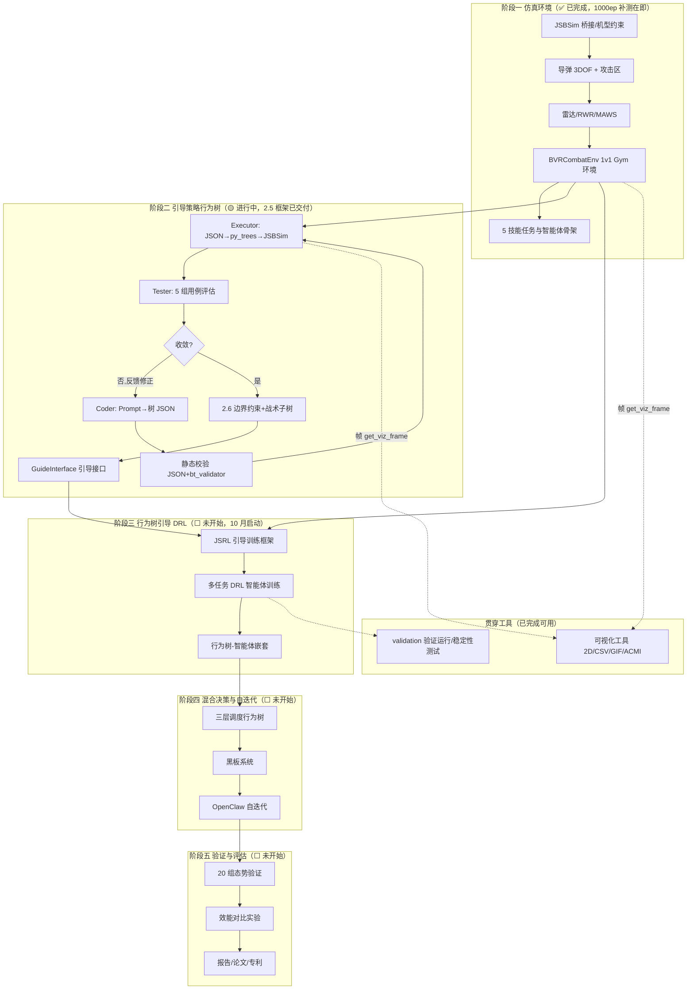
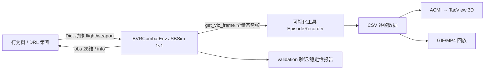

# 组会

## 一、完整工作流程与当前定位

### 1.1 总流程（六阶段路线）

### 1.2 数据/接口链路（已联调验证）

### 1.3 当前定位

| 步骤 | 计划窗口 | 状态 | 证据/产物 |
|------|---------|------|-----------|
| 1.1-1.4 阶段一（环境/导弹/雷达/验证） | 6 月—8 月 | ✅ 已完成（除 1000ep 补测） | `多任务智能体/`（环境/导弹/雷达 44 项单测通过）、`validation/results/` 报告 |
| 2.4 可视化 | 8.12-8.25 | ✅ 已完成（9.03；9.17 独立为 `可视化工具/`，Git `23e3d5f`） | 2D 战术显示、CSV/GIF/MP4、ACMI；20 项单测 |
| 2.5 LLM 行为树生成器-测试器 | 8.26-9.15（M2.5） | 🟡 框架已交付并离线验证（9.17，晚 2 天）；**在线日志待跑** | `引导策略行为树/`（D2.5-1/2/3，19 项单测，离线两轮收敛日志） |
| 2.6 引导策略行为树 | 9.16-10.13（M2.6） | ⬜ 未开始（依赖 2.5 在线验证；边界子树可并行先行） | — |
| 2.7 仿真验证与阶段二收尾 | 10.14-10.31 | ⬜ 未开始 | — |
| 阶段三 JSRL + DRL | 10 月—次年 1 月 | ⬜ 未开始 | — |

> **当前所处位置：阶段二前半段。** 环境与工具链（阶段一 + 2.4）已闭环；2.5 框架已跑通离线全链路，只差真实 LLM 在线收敛日志；2.6 是下一棒，阶段三依赖 2.6 的引导接口。

---

## 二、已完成进度汇报（逐项，含证据）

| # | 内容 | 状态 | 产物/证据位置 |
|---|------|------|--------------|
| 1 | JSBSim 桥接 + F-104 机型约束 + 五任务环境（`jsbsim_env` / `bvr_combat_env`） | ✅ | `多任务智能体/common/`；`README_环境.md` |
| 2 | 导弹 3DOF 模型 + 攻击区/不可逃逸区解算（步骤 2.2） | ✅ | `common/missile_model.py`；`validation/results/D2.2-3_*.png` |
| 3 | 火控雷达/RWR/MAWS（步骤 2.2） | ✅ | `common/radar_model.py`；`README_战场要素.md` |
| 4 | 5 个任务专精智能体 + 三级验证运行（L1/L2/L3） | ✅（验证性） | `agents/`；`validation/results/validation_report.txt` |
| 5 | 接口与环境验证：env_checker、随机 100 步、SB3 挂接、4 实例吞吐 ≥1000 steps/s | ✅ | `validation/results/env_check_and_throughput_report.txt` |
| 6 | 步骤 2.4 可视化：实时 2D 战术显示、CSV 录制、GIF/MP4 回放、TacView ACMI | ✅ | `可视化工具/`（2026-09-17 重构独立并提交） |
| 7 | 步骤 2.5 框架：Coder-Executor-Tester 闭环、Prompt 模板、bt_validator 复用、JSON→py_trees 执行器 | ✅ 离线 | `引导策略行为树/`（D2.5-1/2/3）；19 项单测 |
| 8 | 2.5 离线迭代收敛日志（Round1 覆盖 75% → 反馈修正 → Round2 覆盖 100%、通过率 100%、安全违规 0） | ✅ | `引导策略行为树/examples/iteration_log_离线两轮样例.md` |
| 9 | 行为树接入仿真 + 全量录制联调（Dict 动作 / get_viz_frame / CSV / ACMI 接口统一） | ✅ | `run_tree_sim.py`；24 种子扫描：8 局满 240 s、0 逻辑错误、0 安全违规 |
| 10 | 双机对抗样例数据（供 TacView 人工复核） | ✅ | `引导策略行为树/outputs/sim/bt_ep_seed9.acmi`（+ `.csv`，备选 seed8） |
| 11 | 1000 episode 稳定性测试工具与运行说明（断点续跑；5/20 episode 冒烟通过） | ✅ 工具就绪，正式未跑 | `多任务智能体/validation/run_stability_1000ep.py` + `环境稳定性测试说明.md` |
| 12 | 项目文档体系：状态总览、实施计划书、研究计划、JSBSim 培训资料 5 篇 | ✅ | 项目根目录、`JSBSim_培训与验证资料/` |

> 说明：以上代码与联调开发当前主要由负责人完成；接下来的测试执行、资料保障与验证环节需要各组员按第七节分工接手。

---

## 三、会议现场演示顺序

1. **环境与接口**：跑 5 episode 稳定性冒烟（`run_stability_1000ep.py --episodes 5`，约 10 s）；
2. **行为树生成闭环**：`python -X utf8 llm_bt_generator.py --provider mock --rounds 3`（约 2 min），展示每轮产物 `bt_vN.json/xml`、文本树、`test_report_vN.json`、`iteration_log.md`；
3. **行为树接入仿真**：`python -X utf8 run_tree_sim.py --seed 9`（约 30 s），现场生成 CSV+ACMI；
4. **TacView 回放**：打开 `bt_ep_seed9.acmi`，讲解双方轨迹、导弹、锁定连线、射击日志；
5. **可视化工具**（可选）：`python -m visualization.demo --seed 8 --no-live`（`可视化工具/` 目录下）复现 GIF/ACMI 演示；
6. **测试与验证报告**：`pytest` 三个测试目录结果 + `validation/results/` 报告清单。

---

## 四、2.5 在线验证安排

- LLM 选型建议 **DeepSeek**（成本低、长上下文、OpenAI 兼容协议）；
- 配置 `DEEPSEEK_API_KEY` 后运行（`引导策略行为树/` 目录）：
  `python -X utf8 llm_bt_generator.py --provider deepseek --rounds 3`
- 归档在线 `iteration_log.md`（D2.5-3 第二份样例），记录 API 费用入台账；
- 验收：用例通过率 > 90%、OODA 覆盖 > 95%、安全违规 = 0（至少一轮收敛）；
- 通过后：2.6 的战术执行子树以该在线生成树为起点；
- **已有基础（查询入口）**：2.5 全套源码与用法见 `引导策略行为树/README.md`（§三 快速开始、§五 联调结论）；离线收敛日志样例 `引导策略行为树/examples/iteration_log_离线两轮样例.md`；执行器与 Prompt 分别在 `llm_bt/executor.py`、`prompts/coder_prompt.md`。

## 五、2.6 / 2.7 任务分解（到人、到时、到验收）

> 「已有成果/查询入口」列出该任务可直接复用的现有产物，避免重复开发；对应文件的详细说明见各自 README。

| 阶段 | 任务 | 产出 | 负责人 | 截止 | 验收标准 | 已有成果/查询入口（可直接复用） |
|------|------|------|--------|------|---------|-------------------------------|
| 2.6 | 边界约束子树（纯 Python 硬编码，最高优先级） | `boundary_constraints.py` | 焦阳 | 9.25 初稿 | 过载/速度/高度/禁飞区/燃油五类约束单测通过 | `多任务智能体/common/bvr_combat_env.py` 的 `safety_nz_max_g` 等 `safety_*` 配置（阈值来源）；`common/README_环境.md` 奖励表「安全违规」行；计划书步骤 2.6 五类约束清单 |
| 2.6 | 战术执行子树（以 2.5 生成树为起点） | `tactical_execution_tree.py` | 李欣洋 | 9.28 草案 | 覆盖 OODA 全部关键节点，静态校验通过 | `引导策略行为树/examples/bt_final_离线样例.json` + `tree_v2_文本树样例.txt`（在线树产出后替换）；`prompts/coder_prompt.md`；`llm_bt/executor.py`；`examples/iteration_log_离线两轮样例.md` |
| 2.6 | JSRL 引导接口 | `guide_interface.py` | 李欣洋 | 10.05 | `get_action` / `update_guide_steps` 单测通过 | 计划书步骤 2.6 接口定义；`多任务智能体/agents/base_agent.py` 统一接口约定；环境 Dict 动作说明 `common/README_环境.md`；评估器 `llm_bt/tester.py` |
| 2.6 | 两条子树仿真联调 | 联调记录 | 李欣洋+焦阳 | 10.10 | 仿真中完整执行、无逻辑错误 | `引导策略行为树/run_tree_sim.py`（行为树→仿真→CSV/ACMI，24 种子已验证）；`可视化工具/`（实时显示/回放） |
| 2.7 | 阶段二验证：20 组态势、存活率、安全违规 | 验证数据表 | 李欣洋+焦阳 | 10.25 | 存活率 > 80%、安全违规 = 0 | `run_tree_sim.py --seeds`（批量扫描与汇总）；`多任务智能体/validation/run_stability_1000ep.py`（断点续跑/报告模板）；`validation/results/` 既有报告格式 |
| 2.7 | LLM 树 vs 手写树对比实验 | 对比分析 | 焦阳 | 10.28 | 三项指标（存活/覆盖/工时）成表 | 离线树样例与 `test_report_v*.json` 指标字段；`引导策略行为树/README.md` §六 指标表；mock 树可作"手写基线" |
| 2.7 | 阶段二技术总结报告 | Word | 李欣洋（徐文强协助文献/格式） | 10.31 | 含全部交付物索引与路径 | `项目状态与进度总览.md`（交付物总索引）；各模块 README；计划书交付物编号 D2.x |
| 收尾 | 2.4 环境验证报告 + 使用说明（D2.4-2/3） | Word | 唐煜皓 | 9.27 | 含各验证项结果与截图 | `validation/results/env_check_and_throughput_report.txt`、`D2.2-3_*.png`；`common/README_环境.md`；`JSBSim_培训与验证资料/01-05`；`可视化工具/TacView观看指引.md` |
| 收尾 | 1000 episode 稳定性测试 | 报告 | 焦阳 | 9.20 | 无崩溃、观测/奖励有限、报告归档 | 脚本与说明已就绪：`validation/run_stability_1000ep.py` + `环境稳定性测试说明.md`（含判定标准与断点续跑） |
| 支撑 | 空战规则/安全边界资料包（供 2.6 引用） | 资料清单+摘要 | 徐文强 | 9.26 | 覆盖 5 类边界约束与交战规则 | 现有文献 `资料/`（空战决策/BVR/行为树/JSRL 共 12 篇）；`common/README_战场要素.md`（导弹/雷达参数与交战约束）；`开源项目库/03_行为树与LLM/` 参考文档 |
| 支撑 | 数据/产物归档规范 + 20 组态势数据表模板 | 规范文档/模板 | 徐文强 | 10.15 | 全员按规范提交产物 | `JSBSim_培训与验证资料/03_飞行数据样例与字段字典.md`、`04_数据采集规范与模板.md`；`可视化工具/visualization/recorder.py` CSV 字段定义 |
| 阶段三 | JSRL 训练框架预研（环境并行/接口复盘点） | 预研笔记 | 李欣洋+焦阳 | 10.20 | 阶段三启动会评审 | `多任务智能体/validation/`（L1-L3 验证框架、SB3 PPO 挂接与吞吐报告）；计划书步骤 3.1 |

### 5.1 已有成果索引（按组员，方便查询）

| 组员 | 与自己任务相关的已有成果（查询入口） |
|------|--------------------------------------|
| 李欣洋 | 2.5 全框架 `引导策略行为树/`（README §三 快速开始、§五 联调结论）；在线日志待跑（§四 命令）；交付物总索引 `项目状态与进度总览.md` |
| 焦阳 | 稳定性脚本+说明 `多任务智能体/validation/`；环境安全阈值 `common/bvr_combat_env.py`（`safety_*`）；批量仿真录制 `引导策略行为树/run_tree_sim.py`；对抗样例 `引导策略行为树/outputs/sim/bt_ep_seed9.acmi` |
| 唐煜皓 | 验证报告与图表 `多任务智能体/validation/results/`；环境说明 `common/README_环境.md`、`README_战场要素.md`；可视化工具 `可视化工具/README.md`、`TacView观看指引.md` |
| 徐文强 | 文献库 `资料/`；数据规范与字段字典 `JSBSim_培训与验证资料/03、04、05`；项目档案 `项目状态与进度总览.md`、`大创项目实施计划书.md`、`研究计划与实施方案_详细版.md` |

### 5.2 相关说明

- 上表"已有成果"均为已入库或本机可查产物；缺失的（如在线 LLM 日志、2.6 三份源码）为本次会议后的待产出项；
- 各文件的具体命令与用法优先查对应 README（`引导策略行为树/README.md`、`可视化工具/README.md`、`多任务智能体/common/README_环境.md`）。

## 六、待决策事项

| # | 事项 | 选项 | 建议 | 决策 |
|---|------|------|------|------|
| 1 | LLM 选型 | DeepSeek / GPT-4o / 双通道 | DeepSeek | |
| 2 | API Key 归属与预算登记 | 个人账户 / 公费账户 | 李欣洋开 DeepSeek 账户，费用入台账 | |
| 3 | 2.5 在线收敛达标口径 | 计划书三条 / 追加树质量判据 | 先按计划书三条 | |
| 4 | 2.6 起点树 | 离线 mock 树 / 在线 LLM 树 | 在线 LLM 树 | |
| 5 | 2.4 报告与使用说明 | 补写 / 以总览文档替代 | 补写精简版 Word（验收材料） | |
| 6 | 稳定性测试时段 | 9.19 夜间 / 工作日 | 9.19 夜间首跑 | |

## 七、行动项（会后跟踪，下次例会核对）

| # | 行动 | 负责人 | 截止 |
|---|------|--------|------|
| 1 | 提交 2.5 框架、联调脚本与稳定性工具（Git） | 李欣洋 | 9.19 |
| 2 | 配置 DeepSeek Key，跑在线收敛日志并归档（费用入账） | 李欣洋 | 9.21 |
| 3 | 1000 episode 稳定性测试（报告归档） | 焦阳 | 9.20 |
| 4 | 边界约束子树初稿（`boundary_constraints.py`） | 焦阳 | 9.25 |
| 5 | 空战规则/安全边界资料包 | 徐文强 | 9.26 |
| 6 | 战术执行子树草案（以 2.5 在线树为起点） | 李欣洋 | 9.28 |
| 7 | 2.4 环境验证报告 + 使用说明（视决策 5） | 唐煜皓 | 9.27 |
| 8 | TacView 复核意见反馈（seed9/seed8） | 全体 | 9.20 |
| 9 | 建立经费台账（含 API 明细） | 李欣洋 | 9.20 |
| 10 | 更新《项目状态与进度总览》 | 李欣洋 | 会后当日 |

> 每项行动对应的已有成果、模板与查询路径见 §5.1「已有成果索引（按组员）」；执行前先查，避免重复开发。

## 会议决议记录（会后补填）

| 事项 | 决议 | 备注 |
|------|------|------|
| LLM 选型 | | |
| 2.5 在线验收口径 | | |
| 2.6 分工与节点 | | |
| 稳定性测试排期 | | |
| 其他 | | |
